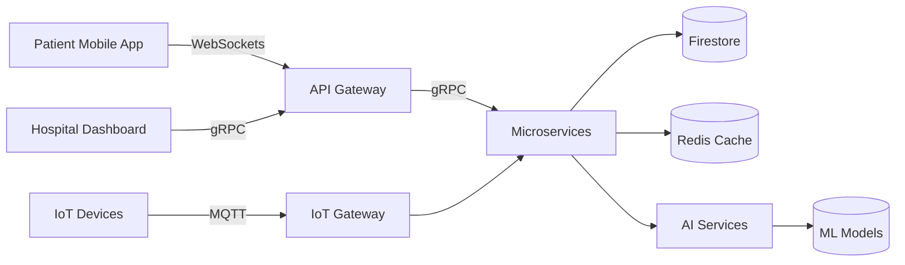
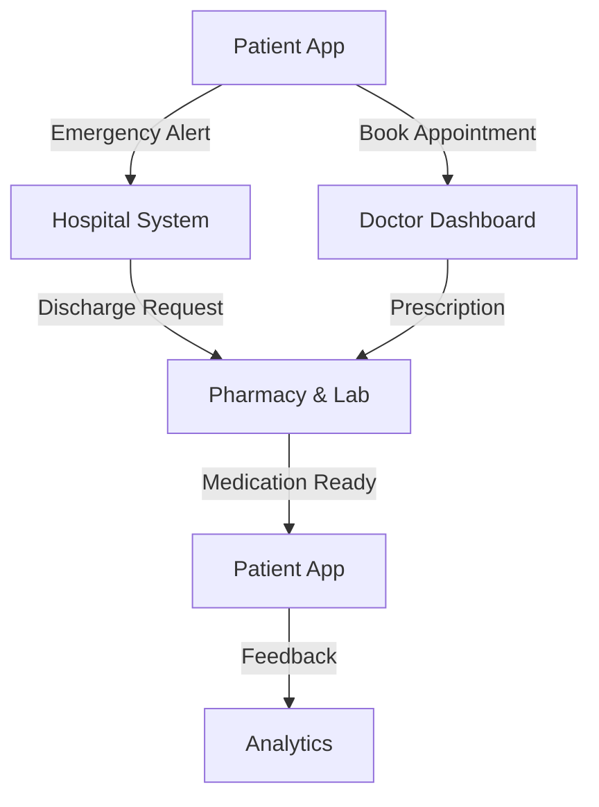
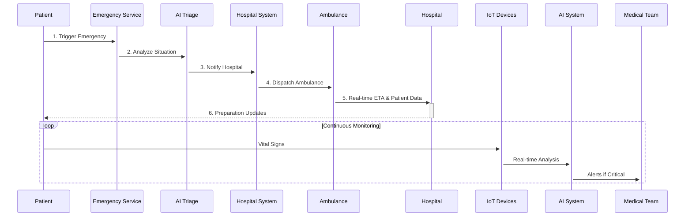

<div align="center">
  
  
  
  # 🚀 ZeroWait 2.0
  ### <span style="background: linear-gradient(90deg, #4F46E5, #06B6D4); -webkit-background-clip: text; -webkit-text-fill-color: transparent;">The Future of Emergency Healthcare</span>
  
  [](https://opensource.org/licenses/MIT)
  [](https://reactjs.org/)
  [](https://firebase.google.com/)
  [](https://www.typescriptlang.org/)
  
  [](https://vercel.com/new/clone?repository-url=https%3A%2F%2Fgithub.com%2FHackVibe2-2025%2FAgents-4.3)
  [](https://zerowait.tech/docs)
  [](https://discord.gg/zerowait)
  
  <div align="center">
    
    
    
  </div>
</div>

> ⚡ **Next-Gen Healthcare Platform** - Leveraging AI, IoT, and Blockchain for seamless emergency response and patient care coordination.

<div align="center">
  <a href="#-key-features">Features</a> •
  <a href="#-tech-stack">Tech Stack</a> •
  <a href="#-getting-started">Getting Started</a> •
  <a href="#-architecture">Architecture</a> •
  <a href="#-workflows">Workflows</a> •
  <a href="#-contributing">Contributing</a>
</div>

---

## ✨ Key Features

<div align="center">
  
</div>

### 🏥 **Patient-Centric Care**
<details>
<summary><b>🚨 Smart Emergency Response</b></summary>
- AI-powered triage with 95%+ accuracy
- One-tap SOS with automatic location sharing
- Real-time ambulance tracking and ETA prediction
- Automated family notification system
- Pre-hospital care instructions via AR
</details>

<details>
<summary><b>🤖 AI Health Assistant</b></summary>
- Conversational symptom checker
- Predictive health analytics
- Medication reminders with smart scheduling
- Chronic condition monitoring
- Mental health support companion
</details>

### 🏥 **Hospital Operations**
<details>
<summary><b>📊 Real-Time Resource Management</b></summary>
- Dynamic bed allocation system
- Staff scheduling optimization
- Equipment tracking with IoT sensors
- Automated inventory management
- Predictive patient flow analytics
</details>

### 🚑 **Clinical Excellence**
<details>
<summary><b>👨‍⚕️ Smart Clinical Tools</b></summary>
- Digital twin patient monitoring
- AI-assisted diagnosis support
- Automated clinical documentation
- Real-time lab result analysis
- Telemedicine integration
</details>

### 👨‍🦱 Patient Experience
- 🚨 One-tap emergency response with GPS location sharing
- 🤖 AI-powered symptom checker and triage
- 🏥 Real-time hospital availability and wait times
- 👨‍⚕️ Video consultations and in-app chat
- 📱 Digital health records and prescription management
- 👨‍👩‍👧 Family health monitoring and alerts

### 🏥 Hospital & Staff Tools
- 📊 Real-time bed and resource management
- 🧑‍⚕️ Doctor and nurse assignment automation
- 📱 Mobile-optimized staff dashboards
- 🔄 Seamless inter-department communication
- 📈 Performance analytics and reporting

### 💊 Pharmacy & Lab Integration
- 📲 Digital prescription processing
- 🔄 Real-time medication inventory tracking
- 🚚 Automated lab test ordering and results
- 📊 Stock management with auto-replenishment

## 🚀 Getting Started

### 🛠 Prerequisites

```bash
# System Requirements
- Node.js 18+ (LTS)
- npm 9+ or pnpm
- Firebase CLI
- Docker (for local development)
- Python 3.10+ (for ML components)
```

### ⚡ Quick Deploy

[](https://vercel.com/new/clone?repository-url=https%3A%2F%2Fgithub.com%2FHackVibe2-2025%2FAgents-4.3)

### 🖥 Local Development

```bash
# Clone with Git LFS
brew install git-lfs
git lfs install
git clone https://github.com/HackVibe2-2025/Agents-4.3.git
cd Agents-4.3

# Install dependencies
npm install
# or with pnpm
pnpm install

# Set up environment
cp .env.example .env

# Start development servers
npm run dev:all  # Starts all services
```

### 🐳 Docker Setup

```bash
docker-compose up -d
```

### 🌐 Production Deployment

[](https://heroku.com/deploy?template=https://github.com/HackVibe2-2025/Agents-4.3)

### Prerequisites
- Node.js 16+ and npm 8+
- Firebase account and project setup
- Google Maps API key

### Installation
```bash
# Clone the repository
git clone https://github.com/HackVibe2-2025/Agents-4.3.git
cd Agents-4.3

# Install dependencies
npm install

# Set up environment variables
cp .env.example .env
# Edit .env with your Firebase config

# Start development server
npm run dev
```

## 🏗 System Architecture

<div align="center">
  
</div>

### 🧩 Tech Stack

| Layer | Technologies |
|-------|-------------|
| **Frontend** | React 18, TypeScript, Tailwind CSS, Redux Toolkit, PWA |
| **Backend** | Node.js, Express, NestJS, GraphQL, WebSockets |
| **AI/ML** | TensorFlow.js, PyTorch, spaCy, Hugging Face |
| **Database** | Firebase Firestore, Redis Cache, PostgreSQL |
| **Infra** | Docker, Kubernetes, AWS/GCP, Terraform |
| **IoT** | MQTT, WebRTC, Web Bluetooth |
| **Security** | JWT, OAuth 2.0, HIPAA Compliance |

### 📡 High-Level Architecture





## ⚡ Smart Workflows

### 🚨 Emergency Response



### 🏥 Patient Journey

| Stage | Features | Tech Used |
|-------|----------|-----------|
| **1. Triage** | AI Symptom Analysis, Priority Scoring | NLP, ML Models |
| **2. Admission** | Digital Check-in, Auto-room Assignment | IoT, Real-time DB |
| **3. Treatment** | E-Prescriptions, Lab Integration | Blockchain, APIs |
| **4. Recovery** | Remote Monitoring, Rehab Plans | Wearables, AI |
| **5. Discharge** | Automated Summaries, Follow-ups | Smart Contracts |

### 📱 Multi-Platform Support

| Platform | Features | Status |
|----------|----------|--------|
| **iOS/Android** | Full feature set with offline support | ✅ Live |
| **Web App** | Responsive dashboard for all users | ✅ Live |
| **Wearables** | Health monitoring & alerts | 🔄 Beta |
| **Smart Displays** | Hospital room integration | 🚧 In Progress |

### Emergency Response Flow
1. Patient triggers emergency alert
2. AI triages and notifies nearest hospital
3. Ambulance dispatched with real-time tracking
4. Hospital prepares for patient arrival
5. Family members automatically notified

### Discharge Process
1. Doctor initiates discharge
2. System notifies pharmacy, nursing, and billing
3. Parallel task completion tracking
4. Automated discharge summary generation
5. Follow-up care coordination

## 🎨 Screenshots & Demos

<div align="center">
  
  
  
  
  [📺 Watch Demo Video](https://youtu.be/demo) | [📱 Download App](https://zerowait.tech/download)
</div>

## 🌟 Join Our Community

[](https://discord.gg/zerowait)
[](https://twitter.com/zerowait_health)

## 🤝 Contributing

We're building the future of healthcare together! Here's how you can help:

1. 👩‍💻 **Code Contributions** - Check out our [Contributing Guidelines](CONTRIBUTING.md)
2. 🐛 **Report Bugs** - [Open an Issue](https://github.com/HackVibe2-2025/Agents-4.3/issues)
3. 💡 **Feature Requests** - [Suggest a Feature](https://github.com/HackVibe2-2025/Agents-4.3/discussions)
4. 📚 **Improve Docs** - Help us make our documentation better

## 📄 License

Distributed under the MIT License. See `LICENSE` for more information.

## 👥 Contributors

<!-- ALL-CONTRIBUTORS-LIST:START -->
Thanks to these amazing people who contributed to this project:

<table>
  <tr>
    <td align="center">
      <a href="https://github.com/kinghoys">
        
        <br />
        <sub><b>kinghoys</b></sub>
      </a>
      <br />
      <span title="Code">💻</span> <span title="Documentation">📖</span> <span title="Ideas">🤔</span>
    </td>
    <td align="center">
      <a href="https://github.com/hamshika1">
        
        <br />
        <sub><b>hamshika1</b></sub>
      </a>
      <br />
      <span title="Code">💻</span> <span title="Design">🎨</span> <span title="Bug fixes">🐛</span>
    </td>
    <td align="center">
      <a href="https://github.com/Ambica-Singh-Rajput">
        
        <br />
        <sub><b>Ambica-Singh-Rajput</b></sub>
      </a>
      <br />
      <span title="Code">💻</span> <span title="Testing">🧪</span> <span title="Documentation">📖</span>
    </td>
  </tr>
</table>

<!-- ALL-CONTRIBUTORS-LIST:END -->

## 🙏 Acknowledgments

- **Medical Advisors** - For their invaluable healthcare insights
- **Open Source Community** - For building amazing tools we depend on
- **Our Team** - For their tireless dedication to improving healthcare
- **You** - For your interest in ZeroWait 2.0!

---

<div align="center">
  Made with ❤️ by the ZeroWait Team | © 2025 ZeroWait Technologies
  
  [](https://github.com/kinghoys/Zero-Wait-4.3/stargazers)
  [](https://twitter.com/zerowait_health)
</div>